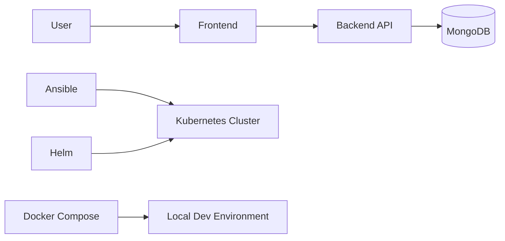

# DevOps Comprehensive Project

This repository showcases a complete DevOps delivery workflow for a MERN ecommerce application. The project was forked from the original application repository and then extended with infrastructure automation, containerization, Kubernetes manifests, Helm packaging, and Ansible-based cluster provisioning.

The goal is not only to run the application, but to demonstrate how a modern DevOps toolchain can package, provision, deploy, and operate it in a repeatable way.

## What This Project Demonstrates

- Infrastructure automation with Ansible
- Containerized local development with Docker Compose
- Kubernetes application manifests
- Helm-based application packaging
- Modular cluster setup using Ansible roles
- Separation of concerns between application code, infrastructure, and deployment logic
- A deployment flow that can be reproduced across environments

## DevOps Tooling Used

### Ansible

Ansible is used to automate Kubernetes cluster preparation and bootstrap tasks. The project includes:

- a single-playbook approach for simpler execution
- a role-based approach for maintainability and reuse
- node pre-configuration
- container runtime installation
- Kubernetes package installation
- control plane initialization
- worker node joining
- cluster validation
- post-bootstrap setup for Helm, Argo CD, and monitoring components

### Helm

Helm is used to package the MERN application as deployable Kubernetes charts. The chart structure helps keep the deployment organized and environment-aware.

- parent chart for the full stack
- subcharts for backend, frontend, and MongoDB
- configurable values for namespaces, ports, and images
- reusable templates and predictable release management

### Kubernetes

Kubernetes provides the runtime platform for the application. The repo includes both raw manifests and Helm-based packaging so the application can be deployed in a declarative, repeatable way.

### Docker

Docker is used for local containerized execution through `docker-compose.yml`, making it easier to test the application stack outside Kubernetes.

## Architecture



### Runtime Flow

1. Ansible prepares the cluster nodes and installs Kubernetes dependencies.
2. Kubernetes is initialized and worker nodes are joined.
3. Helm packages and deploys the application stack.
4. The frontend talks to the backend API.
5. The backend stores and retrieves data from MongoDB.

## Repository Layout

```text
.
├── Ansible/                  # Kubernetes cluster automation
├── Helm/                     # Helm charts for the MERN stack
├── k8s/                      # Raw Kubernetes manifests
├── backend/                  # Application backend
├── frontend/                 # Application frontend
├── docker-compose.yml        # Local containerized stack
└── readme.md                 # Project overview
```

## Why This Design Is Good

- Repeatable: the same playbooks and charts can be used across environments.
- Modular: each part of the platform is separated into its own concern.
- Maintainable: roles and Helm templates reduce duplication.
- Scalable: Kubernetes and Helm make it easier to evolve the deployment.
- Portable: Docker Compose supports local development and testing.
- Auditable: infrastructure changes are expressed as code.

## Best Practices Followed

- Infrastructure as Code through Ansible, Helm, and Kubernetes manifests
- Modular Ansible roles instead of one large monolithic playbook
- Parameterized Helm values instead of hardcoded environment settings
- Clear separation between application code and deployment code
- Namespace-based Kubernetes organization
- Reusable templates and helpers in Helm
- Configurable NodePort and service values for flexible deployment
- Sensitive values kept out of source control where applicable

## Local Development

The project also includes Docker Compose for local testing.

### Services

- backend service on port `8000`
- frontend service on port `3000`
- MongoDB data persistence through a named volume

### Example Usage

```bash
docker compose up --build
```

## Kubernetes Deployment Paths

The repository supports multiple deployment styles:

- Raw manifests in `k8s/`
- Role-driven Ansible bootstrap in `Ansible/proj-with-roles/`
- Helm chart deployment in `Helm/mern-ecommerce/`

This gives flexibility for learning, testing, and demonstrating different DevOps practices.

## Getting Started

1. Review the application source in `backend/` and `frontend/`.
2. Use `docker-compose.yml` for local development.
3. Use the Ansible automation to prepare the Kubernetes cluster.
4. Deploy the Helm chart or the raw Kubernetes manifests.

## Project Origin

This work is based on a forked MERN ecommerce application and expanded into a DevOps-focused delivery project. The application code provides the workload, while the added infrastructure and deployment layers demonstrate how the system is built and operated in practice.

## Acknowledgment

Original application repository:

- [@RishiBakshii](https://github.com/RishiBakshii)

